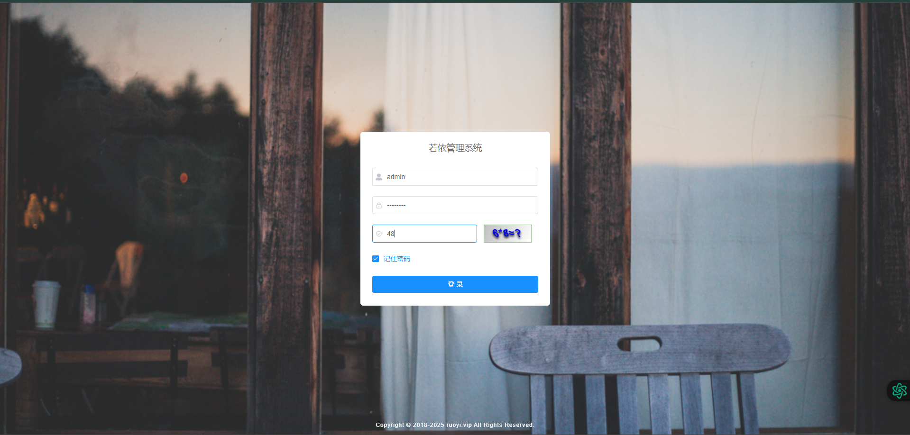
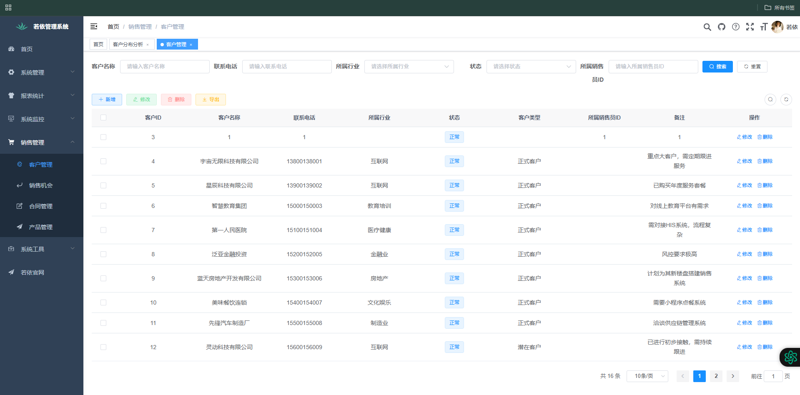
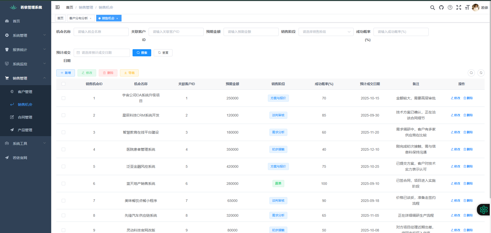
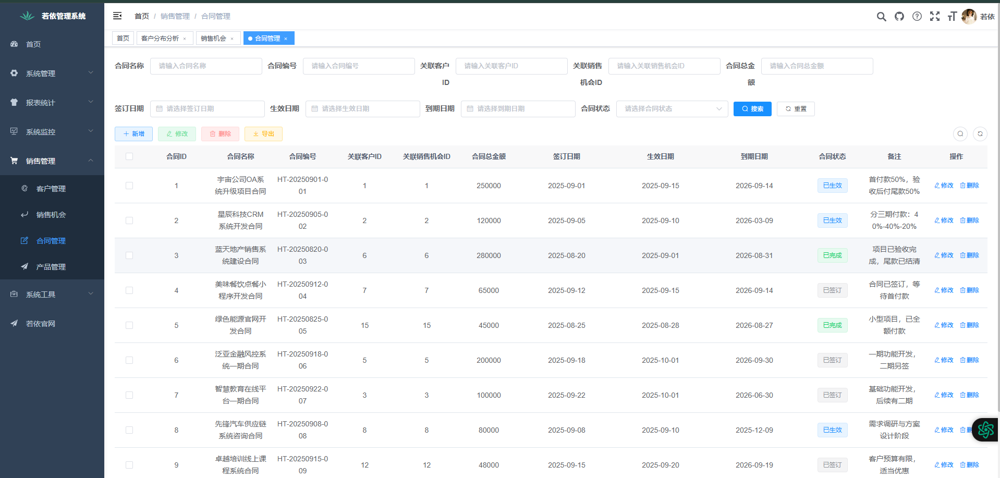
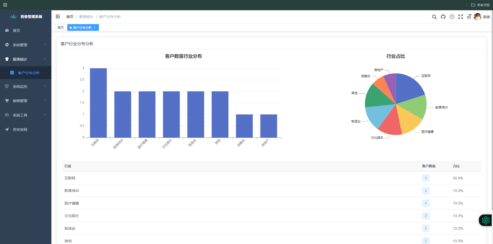
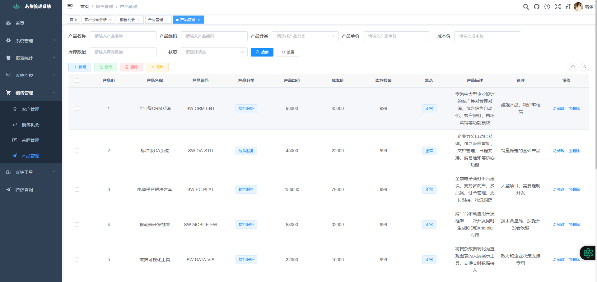

# 🛍️ 销售管理系统 (Sales Management System)

[](https://spring.io/projects/spring-boot)
[](https://vuejs.org/)
[](https://mybatis.org/mybatis-3/)
[](https://www.mysql.com/)
[](LICENSE)

> 基于若依(RuoYi-Vue)框架开发的企业级销售管理系统，涵盖客户管理、销售过程跟踪、合同管理等核心业务流程。

---

## ✨ 系统特色

- **🎯 全流程管理**: 从客户开发、机会跟踪到合同签订，完整覆盖销售业务全生命周期。
- **📊 数据驱动**: 丰富的统计报表，助力企业分析销售业绩与客户分布。
- **👮‍♂️ 权限控制**: 基于角色的权限管理(RBAC)，保障数据安全。
- **📱 响应式设计**: 支持PC、平板、手机等多种设备访问。
- **🚀 技术先进**: 采用Spring Boot + Vue3前后端分离架构，易于维护和扩展。

---

## 🖥 系统功能

### 核心模块
| 模块名称 | 功能描述 |
| :--- | :--- |
| **客户管理** | 客户信息录入、分类标签、联系记录、归属分配 |
| **销售机会** | 机会创建、状态跟踪(初步接触→赢单/输单)、预期金额管理 |
| **合同管理** | 合同创建、审批流程、回款计划、发票记录 |
| **产品管理** | 产品信息、分类管理、库存管理、定价策略 |
| **报表统计** | 销售业绩分析、客户分布分析、产品销量统计 |

### 系统截图
<!-- 在这里添加你的系统截图 -->
| 登录界面 | 客户管理 | 销售看板 |
| :---: | :---: | :---: |
|  |  |  |

| 合同管理 | 数据报表 | 产品管理 |
| :---: | :---: | :---: |
|  |  |  |

---

## 🛠 技术栈

### 后端技术
- **核心框架**: Spring Boot 3.1.4
- **安全框架**: Spring Security + JWT
- **持久层**: MyBatis-Plus 3.5.3.1
- **数据库**: MySQL 8.0
- **缓存**: Redis
- **API文档**: Knife4j

### 前端技术
- **核心框架**: Vue 3.3.4 + TypeScript
- **构建工具**: Vite
- **UI框架**: Element-Plus
- **状态管理**: Pinia
- **路由**: Vue Router 4

---

## 🚀 快速开始

### 环境要求
- JDK 17+
- Node.js 16+
- MySQL 8.0+
- Redis 7+

### 1. 克隆项目
```bash
git clone https://github.com/ningmeng-arch/ahaa.git
cd sales-management-system
